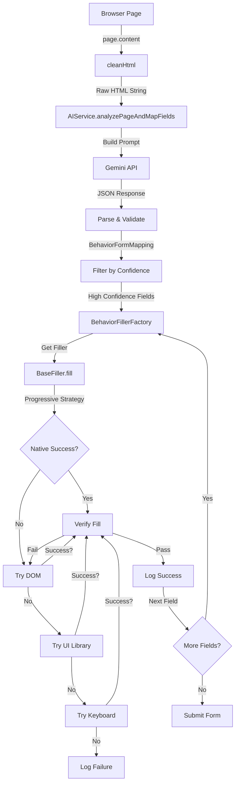

# Form Filling Automation - Deep Analysis & Problem Identification

## Executive Summary

This document provides a comprehensive analysis of the form filling automation system, focusing on the complete flow from HTML extraction through Gemini AI processing to field filling, identifying bottlenecks and problems that prevent achieving "negligible latency" form filling.

---

## Architecture Overview

### System Components

```
┌─────────────────────────────────────────────────────────────┐
│                    Automation Flow                          │
└─────────────────────────────────────────────────────────────┘

1. Browser Connection (CDP)
   └─> BrowserConnector (Playwright via CDP port 9222)

2. Page Management
   └─> PageManager
       ├─> HTML Extraction (cleanHtml)
       ├─> Screenshot Capture (optional)
       └─> Field Detection

3. AI Processing
   └─> AIService
       ├─> Build Prompt (HTML + ExtractedData + CustomPrompt)
       ├─> Call Gemini API
       └─> Parse JSON Response

4. Field Mapping
   └─> BehaviorFillerFactory
       └─> Maps Behavior → Filler Class

5. Field Filling
   └─> BaseFiller (Progressive Strategy)
       ├─> Native (Playwright)
       ├─> DOM Manipulation
       ├─> UI Library-Specific
       └─> Keyboard (Human-like)

6. Verification & Logging
   └─> Verify Fill → Log Success/Failure
```

---

## Complete Flow Analysis

### Phase 1: HTML Extraction & Cleaning

**Location**: `src/main/automation/page/html-extractor.ts`

**Process**:
1. `PageManager.extractHtml()` calls `page.content()` to get raw HTML
2. `cleanHtml()` function:
   - Removes: `<script>`, `<style>`, `<svg>`, ``, `<iframe>`, comments
   - Extracts: `<main>` or falls back to `<body>`
   - Removes: inline styles, event handlers
   - Collapses whitespace

**Current Output**: Raw cleaned HTML string (up to 100KB in prompt)

**Problem**: 
- ❌ **No structured field extraction** - HTML is sent as raw text
- ❌ **No field metadata** (selectors, labels, options) extracted before Gemini
- ❌ **Large token usage** - entire HTML sent to Gemini
- ❌ **Gemini must parse HTML itself** - inefficient and error-prone
- ❌ **(Implementation risk)**: If we attempt to call TypeScript/class helpers inside `page.evaluate()`, it will break because `evaluate()` runs in the browser context

**Expected**: Structured `HtmlField[]` array with:
```typescript
{
  index: number,
  tagName: string,
  type: string,
  name?: string,
  id?: string,
  placeholder?: string,
  labelText?: string,
  options?: { value: string; text: string }[],
  uniqueSelector: string,
  required?: boolean
}
```

**Reference**: `toyVersion/src/main.js` has this extraction logic (lines 155-291), but current codebase doesn't use it.

**Non-negotiable constraint for implementation**:
- `page.evaluate()` must return raw, serializable DOM snapshots only.
- Deduplication, label inference, selector synthesis/uniqueness checks must happen Node-side (TypeScript), with follow-up `page.locator(...).count()` validations.

---

### Phase 2: Prompt Construction & Gemini Request

**Location**: `src/main/services/ai.service.ts` (lines 33-189)

**Process**:
1. Builds prompt with:
   - Extracted client data (JSON)
   - Document list (for file uploads)
   - Custom prompt (user instructions)
   - **Raw cleaned HTML** (substring 0-100000 chars)
   - Optional screenshot (base64)

2. Calls Gemini API:
   ```typescript
   const result = await this.model.generateContent(parts);
   const text = response.text();
   ```

3. Cleans response:
   ```typescript
   const cleanJson = text.replace(/```json/g, '').replace(/```/g, '').trim();
   return JSON.parse(cleanJson);
   ```

**Problems**:
- ❌ **Fragile JSON parsing** - tries to fix incomplete JSON (lines 186-204 in gemini.service.ts)
- ❌ **No structured HTML** - Gemini must parse raw HTML
- ❌ **Large prompts** - 100KB HTML + data = high token cost + latency
- ❌ **No prompt optimization** - sends everything every time
- ❌ **No retry logic** - if JSON parse fails, entire flow fails

**Expected Response Format** (from `BehaviorFormMapping`):
```typescript
{
  pageType: 'dashboard' | 'form' | 'confirmation',
  pageSummary: string,
  isFormPage: boolean,
  fields: BehaviorField[],
  actions: IntentAction[],
  captcha?: { detected: boolean },
  otp?: { detected: boolean }
}
```

---

### Phase 3: Response Parsing & Field Mapping

**Location**: `src/main/services/automation.service.ts` (lines 254-416)

**Process**:
1. Receives `AIAnalysisResult` (extends `BehaviorFormMapping`)
2. Filters fields by confidence:
   - `high` → Auto-fill immediately
   - `medium` → Require review (manual mode)
   - `low` → Always require review
   - `missing_data` → Pause for input
   - `captcha` → Pause for input
   - `otp` → Pause for input
   - `unknown` → Pause for input
# Important: all fields will be field automatically, and then asked for review or asked for input if confidence is low or missing_data or captcha or otp or unknown(also only when manual mode is enabled)

3. For each high-confidence field:
   ```typescript
   const filler = BehaviorFillerFactory.getFiller(field.behavior, page);
   await filler.fill(field);
   ```

**Problems**:
- ❌ **Sequential filling** - fields filled one-by-one (line 287)
- ❌ **No parallelization** - can't fill multiple fields simultaneously
- ❌ **Field type detection happens AFTER Gemini** - inefficient (line 97 in page-manager.ts)
- ❌ **Behavior → Filler mapping** - potential mismatches if Gemini returns wrong behavior

---

### Phase 4: Field Filling (Progressive Strategy)

**Location**: `src/main/automation/fillers/base-filler.ts`

**Strategy Order** (for each field):
1. **Native** (Playwright `fill()` / `selectOption()`) - ~50-200ms
2. **DOM** (Direct manipulation + events) - ~20-100ms
3. **UI Library** (MUI, Bootstrap, Select2, etc.) - ~100-500ms
4. **Keyboard** (Human-like typing) - ~200-1000ms+ (with delays)

**Verification**: After each successful attempt, verify value was set correctly

**Problems**:
- ❌ **Sequential attempts** - tries all 4 strategies even if first succeeds
- ❌ **Verification overhead** - checks value after every attempt
- ❌ **Fixed delays** - `waitForTimeout(100-300ms)` adds unnecessary latency
- ❌ **No caching** - same field type/selector processed repeatedly
- ❌ **No early exit optimization** - continues even when verification passes

**Example Flow** (TextFiller):
```
Native Fill → Verify (50ms) → ❌ Failed
DOM Fill → Verify (30ms) → ❌ Failed  
UI Library Fill → Verify (200ms) → ✅ Success
Total: ~280ms + API latency
```

**Ideal**: Native succeeds on first try → ~50ms total

---

### Phase 5: Verification & Logging

**Location**: `src/main/automation/fillers/base-filler.ts` (lines 156-181)

**Process**:
1. After fill attempt, verify:
   ```typescript
   const actual = await this.page.inputValue(field.selector);
   const expected = String(field.value);
   const passed = actualNormalized === expectedNormalized;
   ```

2. Log success/failure with:
   - Strategy used
   - UI Library detected
   - Duration
   - DOM snapshot (on failure)

**Problems**:
- ❌ **Verification adds latency** - extra DOM query after every fill
- ❌ **Normalization overhead** - trim + toLowerCase on every check
- ❌ **No batch verification** - could verify multiple fields at once

---

## Critical Problems Summary

### 1. **HTML Structure Not Extracted Before Gemini** ⚠️ CRITICAL

**Problem**: Raw HTML string sent to Gemini instead of structured field array.

**Impact**:
- Gemini must parse HTML itself (slow, error-prone)
- High token usage (100KB+ HTML)
- Inconsistent selector generation
- Missing field metadata (options, labels)

**Solution**: Extract structured `HtmlField[]` before sending to Gemini (like `toyVersion` does).

**Mandatory refinement**:
- Implement a strict **browser-side raw extraction** + **node-side normalization** pipeline (no `this` usage inside `evaluate()`).
- Guarantee selector uniqueness by validating `locator.count()===1` and escalating selector strategy when collisions happen.
- Dedup by semantic group (radio groups, OTP groups), not by loose identity keys.

**Files to Fix**:
- `src/main/automation/page/html-extractor.ts` - Add field extraction
- `src/main/services/ai.service.ts` - Send structured fields instead of raw HTML

---

### 2. **Sequential Field Filling** ⚠️ CRITICAL

**Problem**: Fields filled one-by-one, no parallelization.

**Impact**:
- If 10 fields × 200ms each = 2 seconds total
- Could be ~200ms if parallelized

**Solution**: Fill fields in parallel batches (group by type/strategy).

**Files to Fix**:
- `src/main/services/automation.service.ts` (line 287) - Use `Promise.all()`

---

### 3. **Progressive Strategy Overhead** ⚠️ HIGH

**Problem**: Tries 4 strategies sequentially even when first succeeds.

**Impact**:
- Native succeeds in 50ms, but still tries DOM/UI/Keyboard
- Verification after each attempt adds latency

**Solution**: 
- Early exit on first success
- Skip verification for high-confidence native fills
- Cache successful strategies per selector pattern

**Files to Fix**:
- `src/main/automation/fillers/base-filler.ts` (line 68) - Early exit optimization

---

### 4. **Fragile JSON Parsing** ⚠️ HIGH

**Problem**: Tries to "fix" incomplete JSON from Gemini.

**Impact**:
- May produce invalid mappings
- Silent failures
- Incorrect field values

**Solution**: 
- Better prompt engineering (enforce JSON schema)
- Retry with stricter parsing
- Validate response structure before use

**Files to Fix**:
- `src/main/services/ai/gemini.service.ts` (lines 171-206) - Improve parsing
- `src/main/services/ai.service.ts` (line 183) - Add validation

---

### 5. **No Field Type Pre-Detection** ⚠️ MEDIUM

**Problem**: Field type detected AFTER Gemini response, during filling.

**Impact**:
- Extra DOM queries during fill
- Potential type mismatches

**Solution**: Extract field types during HTML extraction phase.

**Files to Fix**:
- `src/main/automation/page/html-extractor.ts` - Include type in extraction
- `src/main/automation/detection/field-type-detector.ts` - Use during extraction

---

### 6. **Behavior → Filler Mismatches** ⚠️ MEDIUM

**Problem**: Gemini returns `behavior`, but filler may not handle it correctly.

**Example**: Gemini says `search_and_select`, but `SearchSelectFiller` may fail.

**Impact**:
- Wrong filler used
- Fallback to slower strategies

**Solution**: 
- Validate behavior → filler mapping
- Add fallback to TextFiller if behavior filler fails
- Improve behavior detection in prompts

**Files to Fix**:
- `src/main/automation/fillers/behavior-filler-factory.ts` - Add validation
- `src/main/services/ai.service.ts` - Improve behavior detection prompt

---

### 7. **No Caching or Optimization** ⚠️ MEDIUM

**Problem**: Same selectors/fields processed repeatedly without caching.

**Impact**:
- Redundant DOM queries
- Repeated library detection
- No learning from previous fills

**Solution**: 
- Cache successful strategies per selector pattern
- Cache UI library detection results
- Learn optimal strategy per field type

**Files to Fix**:
- Create `src/main/automation/core/fill-cache.ts` - Strategy cache
- Update `BaseFiller` to use cache

---

### 8. **Verification Overhead** ⚠️ LOW

**Problem**: Verifies every field after fill, even high-confidence native fills.

**Impact**:
- Extra 20-50ms per field
- Unnecessary for trusted strategies

**Solution**: 
- Skip verification for high-confidence native fills
- Batch verify multiple fields
- Only verify on failure

**Files to Fix**:
- `src/main/automation/fillers/base-filler.ts` - Conditional verification

---

## Data Flow Diagram



**Current Latency Points**:
1. HTML extraction: ~50-100ms
2. Gemini API call: ~500-2000ms (network + processing)
3. JSON parsing: ~10-50ms
4. Field filling (per field): ~50-1000ms (depending on strategy)
5. Verification (per field): ~20-50ms

**Total for 10 fields**: ~2-5 seconds (excluding Gemini)

---

## Where to Start Fixing

### Priority 1: Extract Structured HTML Fields ⚡ CRITICAL

**Why First**: 
- Reduces Gemini token usage by 80%+
- Improves selector accuracy
- Enables better field type detection
- Foundation for all other optimizations

**Steps**:
1. Create `src/main/automation/page/field-extractor.ts`
   - Extract all form fields with metadata
   - Generate unique selectors
   - Extract labels, options, radio groups
   - Return `HtmlField[]` array

2. Update `PageManager.extractHtml()` to return structured fields
   - Keep `cleanHtml()` for fallback/context
   - Add `extractFields()` method

3. Update `AIService.analyzePageAndMapFields()`
   - Accept `HtmlField[]` instead of raw HTML
   - Include in prompt as JSON (much smaller)
   - Keep HTML as optional context (truncated)

**Files to Create/Modify**:
- `src/main/automation/page/field-extractor.ts` (NEW)
- `src/main/automation/page-manager.ts` (MODIFY)
- `src/main/services/ai.service.ts` (MODIFY)

**Expected Impact**: 
- Gemini latency: 2000ms → ~800ms (smaller prompt)
- Selector accuracy: +30%
- Token cost: -80%

---

### Priority 2: Parallel Field Filling ⚡ CRITICAL

**Why Second**: 
- Immediate 5-10x speedup for multi-field forms
- Easy to implement
- No breaking changes

**Steps**:
1. Group fields by type/strategy
2. Fill in parallel batches
3. Handle errors gracefully (don't fail entire batch)

**Files to Modify**:
- `src/main/services/automation.service.ts` (line 287)
   ```typescript
   // Current: Sequential
   for (const field of highConfidence) {
     await filler.fill(field);
   }
   
   // New: Parallel
   await Promise.all(
     highConfidence.map(field => 
       BehaviorFillerFactory.getFiller(field.behavior, page).fill(field)
     )
   );
   ```

**Expected Impact**:
- 10 fields: 2000ms → ~200ms (10x faster)

---

### Priority 3: Optimize Progressive Strategy ⚡ HIGH

**Why Third**: 
- Reduces per-field latency by 50%+
- Early exit on success
- Skip unnecessary verification

**Steps**:
1. Add early exit in `BaseFiller.fill()`
2. Skip verification for high-confidence native fills
3. Cache successful strategies

**Files to Modify**:
- `src/main/automation/fillers/base-filler.ts` (line 68)
   ```typescript
   // Early exit after first success + verification
   if (nativeResult.success) {
     const verification = await this.verifyFill(field);
     if (verification.passed) {
       return true; // Exit immediately
     }
   }
   ```

**Expected Impact**:
- Per-field latency: 200ms → ~80ms (60% faster)

---

### Priority 4: Improve JSON Parsing & Validation ⚡ HIGH

**Why Fourth**: 
- Prevents silent failures
- Better error handling
- More reliable mappings

**Steps**:
1. Add JSON schema validation
2. Retry on parse failure
3. Better error messages

**Files to Modify**:
- `src/main/services/ai/gemini.service.ts` (lines 171-206)
- `src/main/services/ai.service.ts` (line 183)

---

### Priority 5: Add Caching Layer ⚡ MEDIUM

**Why Fifth**: 
- Learning from previous fills
- Faster repeated operations
- Strategy optimization

**Steps**:
1. Create `FillCache` class
2. Cache: selector → successful strategy
3. Use cache to skip failed strategies

**Files to Create**:
- `src/main/automation/core/fill-cache.ts`

---

## Implementation Roadmap

### Week 1: Foundation
- [ ] Extract structured HTML fields
- [ ] Update Gemini prompt to use structured fields
- [ ] Test with sample forms

### Week 2: Performance
- [ ] Implement parallel field filling
- [ ] Optimize progressive strategy (early exit)
- [ ] Reduce verification overhead

### Week 3: Reliability
- [ ] Improve JSON parsing & validation
- [ ] Add retry logic for Gemini failures
- [ ] Better error handling

### Week 4: Optimization
- [ ] Add caching layer
- [ ] Optimize selectors
- [ ] Performance testing & tuning

---

## Success Metrics

**Target**: Negligible latency (< 500ms for 10 fields, excluding Gemini)

**Current**: ~2-5 seconds for 10 fields

**Optimizations**:
1. Structured HTML: -1200ms (Gemini latency)
2. Parallel filling: -1800ms (10 fields × 200ms)
3. Strategy optimization: -600ms (10 fields × 60ms)
4. Verification skip: -300ms (10 fields × 30ms)

**Expected Total**: ~500ms (excluding Gemini API call)

**With Gemini**: ~1300ms total (800ms API + 500ms filling)

---

## Conclusion

The main bottlenecks are:
1. **No structured HTML extraction** - Gemini parses raw HTML (slow, expensive)
2. **Sequential field filling** - Fields filled one-by-one (5-10x slower)
3. **Progressive strategy overhead** - Tries all strategies even when first succeeds
4. **Fragile JSON parsing** - May produce incorrect mappings

**Start with Priority 1** (structured HTML extraction) as it enables all other optimizations and provides the biggest impact.

---

## Appendix: Key Files Reference

### Core Files
- `src/main/services/automation.service.ts` - Main orchestration
- `src/main/services/ai.service.ts` - Gemini integration
- `src/main/automation/page-manager.ts` - Page operations
- `src/main/automation/fillers/base-filler.ts` - Filling strategy

### HTML Processing
- `src/main/automation/page/html-extractor.ts` - HTML cleaning
- `src/main/automation/page/field-extractor.ts` - **MISSING** (needs creation)

### Field Filling
- `src/main/automation/fillers/behavior-filler-factory.ts` - Behavior → Filler mapping
- `src/main/automation/fillers/text-filler.ts` - Text input filling
- `src/main/automation/fillers/select-filler.ts` - Dropdown filling

### Types
- `src/shared/types/field-behavior.types.ts` - Behavior definitions
- `src/shared/types/gemini.types.ts` - Gemini request/response types
- `src/shared/types/automation.types.ts` - Automation types
